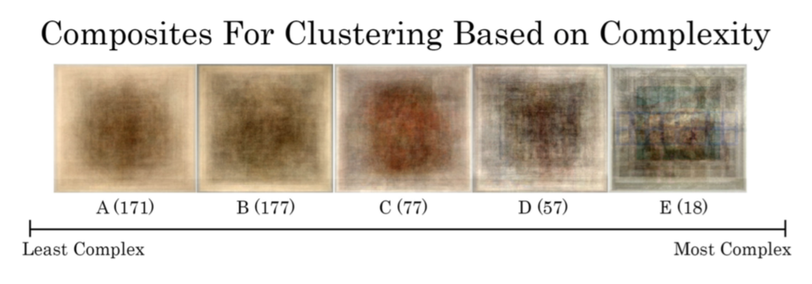

# Clustering The WCMA Digital Collection 
This project was done for my Data Mining class at Williams College in spring 2018. Along with my partner, Yolanda Zhao, I analyzed images in the data set of digitized artworks to cluster the collection using sets of newly defined features that aim to capture (dis)similarity outside of traditional criterion (ex. artist, date, and genre). After clustering the dataset, we created a web application via Shiny that gives the user customized recommendations from the WCMA collection based on their artistic preferences.

## Introduction
The Williams College Museum of Art's Mellon Digital Project gives students, faculty, researchers, artists and many others easy access to downloading metadata and thumbnail images for the entire WCMA collection. The availability of such a large collection of over 5000 digitized artworks opens up the possibility of creatively engaging with these works using tools that are not traditionally available to art historians and curators, such as machine learning and data visualization.
Typically, art historians and curators define dis(similarity) between artworks based on criterion such as artist, genre, date, geography, etc. Our primary goal for this project is to cluster a manageable proportion of the WCMA collection (randomly selected 500 images) according to a set of newly defined features that aim to capture (dis)similarity outside of these typical and rigidly defined categories.

We present four new ways of thinking of dissimilarity between artworks (we refer to these as feature sets):
1. Complexity: a combined measure of the variation of hue, luminosity, saturation,etc.
2. Personality: a combine measure of the dominance of warm colors, average value/saturation,
etc.
3. Centrality: whether or not there is a central object in the image or if there is some kind of framing in the image.
4. Color: whether or not 40 percent or more of the pixels in an image are primarily of one color (red, orange, yellow, green, blue, purple, black, white, or gray). If not, then we categorize the image as "colorful". Otherwise, the variable takes the name of the primary color.

For the first three ways of defining dissimilarity, we used the k-means clustering algorithm (described in the methods section) to group the images into clusters based on features that we created. For the last one, we did not need to run a clustering algorithm because there is only one feature in it.

Here is a list of terms that are frequently used in the sections below:
1. Feature: a variable pertaining to a specific quality about an image.
2. Feature set: a group of features that we will use to form clusters.
3. Pixel: the smallest single unit of a digital image.
4. Resize: using R, we can adjust the number of pixels that form the image. By sizing down, we are essentially reducing the resolution of the image by using fewer pixels to make it.
5. HSV System: using combinations of hue, saturation, and value, we can theoretically represent any color.
6. n-Neighbor: a pixel that is n pixels away from a selected pixel. For instance, a 1-Neighbor-left refers to the first pixel to the left of a selected pixel.
7. Correlation: captures how strongly related two variables are.
8. Standard Deviation: captures how spread out a group of values is from its average.

## Method 

### Feature Engineering 
Here are the 11 features that we will be using to capture dissimilarity and cluster the collection. Each image will have a quantitative value for each of its 11 features.
1. Center: As shown in the diagram below, we evenly split each (resized ) image into 64 boxes and take the absolute difference between the average hue of the 16 boxes in the center (colored in orange) and that of the 48 boxes surrounding them. This feature would help us identify if there's something in the center of the image that might be the point of focus.

  < />

2. Edges: Measures how a picture's edge varies in hue via standard deviation. The edge is defined as the outer 28 boxes . Some pictures include a frame, in which case there would be very small variability in the hue of the edge.
3. Value Mean: Value is a measure of lightness/darkness. The average of an image's value across all of its pixels can give us information on the overall brightness of an image relative to other images.
4. Value Variance: Measures how much value varies among an image's pixels. If there is low variability, then the pixels all tend to be either light or dark.
5. Saturation Mean: Saturation measures the intensity of a color. The mean of an image's saturation across all of its pixels can give us information on the overall color intensity of an image relative to other images.
6. Saturation Variance: Measures how much saturation varies among an image's pixels. If there is low variability, then the pixels all tend to have intense colors or not.
7. Dominance: Using the k-means clustering algorithm (described in the methods section), we formed 8 clusters for the pixels in an image based on their values of hue, saturation, value. We recognized that having only eight clusters to represent color might not be able to capture all the unique colors that can compose an image, but we decided that eight was a good number to represent the fundamental colors, since the most common retail packages for crayons are in multiples of eight. Dominance measures the proportion of pixels that are in the largest cluster. If an image has "dominance" of .8, that means 80 percent of the pixels of the image are similar in hue, saturation, and value.
8. 2-Neighbors-Left: We randomly selected 500 pixels from the image and looked at the corre- lation between the grayscale intensity of the selected pixel and that of the second pixel to its left.
9. 2-Neighbors-Above: We randomly selected 500 pixels from the image and looked at the correlation between the grayscale intensity of the selected pixel and that of the second pixel above it.
10. Warmth: Measures the proportion of warm colored pixels, defined as pixels for which the hue is less than or equal to 90 or between 330 and 360.
11. Color: Outside of these ten features that we used to form clusters, we also created the "color" feature, which we described in the introduction.

We grouped the set of images based on 4 feature sets, which consist of a subset of the 11 features above. "Colorful" is special because it forms a feature set by itself, on which we did not need to run clustering algorithm. Each feature set is supposed to represent one quality that pertains to dissimilarity. For example, the "complexity" feature set contains a set of features that all aim to capture the uniformity/complexity of a given image, including saturation variance. Using the clustering algorithm, we can theoretically group images of similar levels of complexity into their respective clusters.

### Measuring Dissmilarity 

In order to use these features to group the images into clusters, we used a distance measure to calculate how different an image is from another image. We decided to use the Manhattan distance, which is the sum of absolute differences of each of the features for two given images, to measure distance. A given image will have a value for each of the 10 features that we use in our clustering algorithm. To calculate the Manhattan distance between image A and image B, we can take the difference between the first feature (ex. "center") for both images and take the absolute value of that difference.
Note that we have to standardize the values so that the values for the features are on the same scale, so that one feature that has values in the 1000's and another that has values in the 10's can have the same impact on distance. We can do this for each feature in our feature set, and then sum the absolute differences. This gives us the Manhattan distance between image A and image B, for that given feature set. Essentially, a larger Manhattan distance implies a more significant difference in the features of two images for a given feature set.

### Clustering Algorithm 
In order to separate the set of images into clusters, we used the k-means partitioning algorithm because it is computationally efficient, intuitive, and generally works well for large datasets, such as the one we are dealing with for this project. 
In order to run the k-means partitioning algorithm, we needed to pre-specify the number of clusters for each feature set (the number of clusters is referred to as k). To do this, we examined average silhouette plots, which plot the average silhouette on the y-axis and k on the x-axis. Essentially, average silhouette captures how well the clusters are separated from each other. The higher the average silhouette, the more clearly separated the clusters are. Since we wanted the clusters to be distinct from each other, we wanted as high of an average silhouette as possible. The average silhouette plot we got for the first feature set is shown below.
For both the first and the second feature set, we found that the average silhouette was greatest at k=2. We were hesitant to use such a small k, as we would risk having dissimilar images clustered together, since the nearest group means might be very different from the features of a certain image, but that image would still be grouped in that cluster because its means are the closest. On the other hand, if we used a large k, we would risk having two otherwise similar images that should be grouped together being in two different groups, since the differences between two groups' means can be very small (which suggests the two groups can potentially just be one group).
We decided to use k=5 for the first feature set and k=6 for the second feature set, as anything less would probably result in images within each cluster not being as similar, and any value of k between 5 and 20 and 6 and 20, respectively, resulted in a significantly lower average silhouette. For the third feature set, centrality, we decided that it made sense to use k=2, as the algorithm can probably group centered images and un-centered images into two separate clusters.
We ran a k-means clustering algorithm for each of the three feature sets, creating 5, 6, and 2 clusters for the first, second, and third feature sets, respectively. We also created 9 clusters using the "colorful" feature: red, orange, yellow, green, blue, purple, black, white, and colorful (which means the color scheme of an image isn't primarily of one color.)

## Results

We visualized the cluster results by creating a composite image for each cluster under each feature set (complexity, personality, centrality,color.) The idea of the composite is to resize each image into 128x128 pixels, take the average hue, saturation, and value of each pixel across all the images in the same cluster, and create a new image using these average values. Each composite image is essentially an average of the images in a given cluster.

### Complexity

"Complexity" measures the variability of color and brightness of an image. As we can see from the composite images (shown below), there is a clear difference between the most complex groups (whose composites are on the right end) and the least complex groups. Note that the 
"scale" we present here is not objective - one can easily rearrange the five composites based on how visually complex one perceives each one to be. We use letters to represent each composite, and the number in the parenthesis represents the size of the cluster. For example, A (114) means that composite A is composed of 114 images.

### Personality 

As we can see from the composite images (shown below), each one has a different 
"personality" to it. For instance, composite E appears to be more gloomy than composite D.

### Centrality 

Ideally, one of these two composites should not have any discernible edge. However, as shown below, both composites images have a clear separation between the central subject and the edge, with the first one's central subject spreading out slightly more to its edges.

### Color  

We are pleased to present the composite results below for each color group. We believe that this feature did a good job at grouping the colors, as most of the 9 colors are clearly and uniquely visible in its corresponding composite.

## Discussion 
Compared to more traditional means of categorizing art, such as time period, artist, and genre, the features we used to group images are based on their inherent visual qualities, such as luminosity and hue. On one hand, this speaks to the limitation to our engagement with the artwork because we overlooked certain objective information that could assist us in categorizing the images and understand their positions in a socio-historical context. On the other hand, by not including these kinds of conventional information in our clustering, we open up the possibility of reading an artwork in a more artistically autonomous manner, as we only relied on the visual information of the images, grouping artworks by the "art" itself as opposed to contextual information about a piece of art.
That being said, the nature of the project also limited us to using the digital representations of the images in our analysis. This means that we can only have a two dimensional, pixel repre- sentation of the artworks, without given any information on other qualities that can be important to the experience of viewing an image, such as texture and size. This is an inevitable limitation that comes with us being able to access such a large of collection of works digitally.
Furthermore, in creating the features that we used to cluster the images, we could not com- pletely eliminate the element of subjectivity. For example, when we created color groupings, we needed to strictly define which combinations of hue, saturation, and value fell into specific color groups. We chose to be general and vague with our definition of color and used 9 colors to represent the range of possible colors that can appear in the images. Of course, this does not capture all of the unique possible representations of colors, so another statistician could choose to implement 40 colors instead of 9 and get a different result (with many more clusters). Another example is when we used the k-means clustering algorithm and needed to specify a value of k at the beginning. We needed to do this for the dominance feature as well as for forming the clusters after calculating dissimilarity. There is no conventional method for determining the most suitable value of k, so we looked at the average silhouette plot and exercised our best judgment.
Overall, we are pleased with the results of our work, especially considering the fact that we did not use any metadata information. This project has helped us reconsider our perception of and relationship to artwork and we hope that our project can serve as a foundation for future WCMA endeavors to improve a user's digital experience with viewing art, such as a recommendation platform based on viewing history or a filtering system to facilitate searching for artworks with specific visual qualities.

